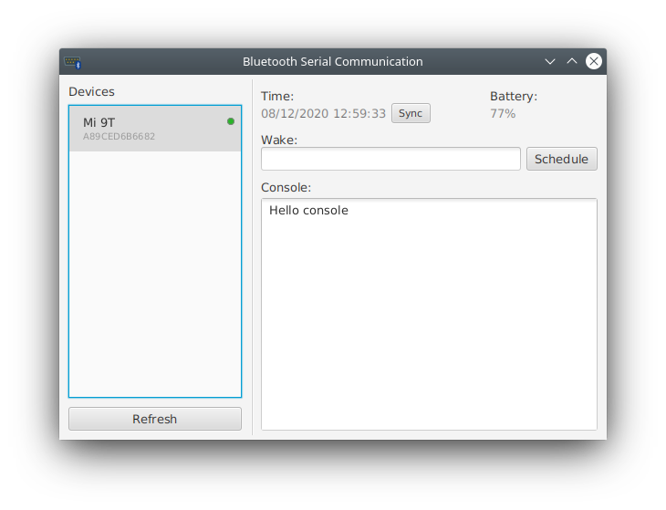

# Bluetooth-Serial-Communication

Used for communications with bluetooth devices via de Serial-Port Profile.

## How to test

1. Download an app called *BT SPP Server* from the Play Store;
1. Pair your smartphone with your computer, through the operating system bluetooth settings (Linux, Windows or Mac OS X);
1. Execute the application and click the *Refresh* button. \
**Note:** Some mobile phones require you to be on the bluetooth page to correctly be detected by the application. \
**Note 2:** You must be running the *BT SPP Server* in the background for the application to recognize you as a compatible device, otherwise it will not detect any device.
1 . Send any of the available commands from the mobile phone.

## Available commands (Example Device)

### Device -> GUI Interface
Command | Description
------- | -----------
consoleclear | Clears the console of the GUI interface
console:%TEXT% | Adds the string represented by %TEXT% to the GUI interface's console
time:%TIME% | Sends the time represented by %TIME% (in UNIX milliseconds) to the GUI interface. The interface extrapolates the devices future time.
battery:%LEVEL% | Sends the device battery level represented by %LEVEL% (between 0 and 1) to the GUI interface.

### GUI Interface -> Device
Command | Description
------- | -----------
time:%TIME% | Syncs the desktop time represented by %TIME% (in UNIX milliseconds) to the selected device.
wake:%TIME% | Schedules a wake-up time represented by %TIME% (in UNIX milliseconds) on the selected device.
